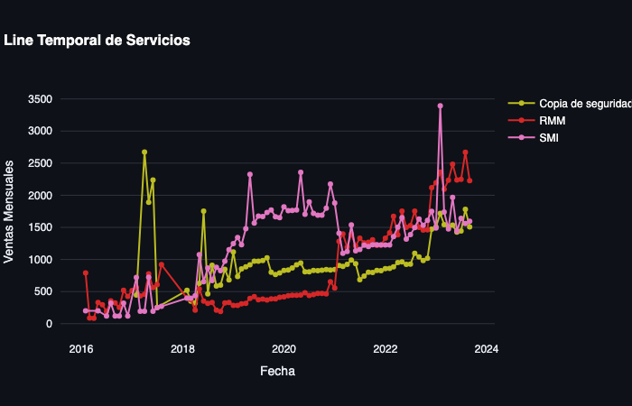

# Dashboard_App

Aplicación de dashboarding para una empresa privada con el objetivo de visualizar y analizar la progresion de la empresa, clientes y servicios. (desde las ventas)

## Objetivo:

El cliente quiere poder visualizar y entender el progreso de su empresa desde las ventas.
Analisis Genneral de las ventas.

## Proceso:

### 1. ETL

Tras recibir los datos de factura de la empresa hice la ETL y converti los datos privados en una base de datos con los clientes, la empresa y los metodos de pago anonimizados para poder trabajar para el proyecto de ironhack y presentarlo sin fallar al contrato empresa-cliente. Genere una base de datos juntanod los desgloses. Esta tiene tablas intermedias para poder subirla a un servidor SQL si se quisiese. (por motivos de privacidad comentados previamente no lo mostraré).

### 2. Graficas Plotly:

Genere de estos datos una serie de graficas usando plotly para poder visualizar los clientes, desgloses de cliente, servicios y general. Plotly ademas tiene una innterfaz en cada grafica para la nnavegación y guardado de las tablas.

### 3. APP (Streamlit demo)

Utilizando las graficas generadas anteriormente y aplicando las herramientas de streamlit para permitir el filtrado de datos (multiselectbpox, slider, selectbox) genere una web dashboar interactiva. 

Esta web permite al ususario generar sus propias graficas de forma sencilla para estudiar los clientes, los servicios, los outliers y las ventas generales. 

Los principales beneficios son el uso fácil para el cliente y la versatilidad para visualización.

### 4. Objetivo Final

No se realizo para el proyecto pero se estudiara a futuro con el cliente. 

Implementacion de la app generando un pipeline (usando el codigo ya escrito en la ETL) para extraer mensualmente las facturas y actualizar la aplicacion mensualmente y manteniendolo en un servidor del cliente.

## Analisis General:

### Vision general ventas sin outliers:

### Vision general ventas de outliers:

### Importe Ventas por servicio:

### Importe de Ventas Por Numero de Compras:

### Servicios Estables:

### Servicios Volatiles:

### Observaciones:
* #### La empresa ha tenido un progreso positivo. Se observa estaccionalidad y picos lo que derivan en alta varianza.
* #### Hay dos tipos de servicios con alta rentabilidad (no poseemos precios de coste).
* #### Primer tipo los servicios estable que tienen un incremento en el importe de venntas constante y una frecuencia muy alta.
* #### El segundo son servicios muy volatiles y con una varianza muy alta. 
* #### El segundo tipo trae muchos más ingresos pero la estabilidad del primer tipo y su tendencia ascendente son muy prometedoras. 
* #### Estudiar los costes del tipo estable para mantener la tendencia y convencer al resto de clientes para contratar estos servicios.
* #### Los servicios mas volatiles requieren de clientes nuevos y por ello podriamos asumir que requieren mayor coste.
